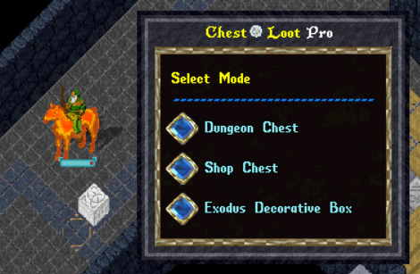
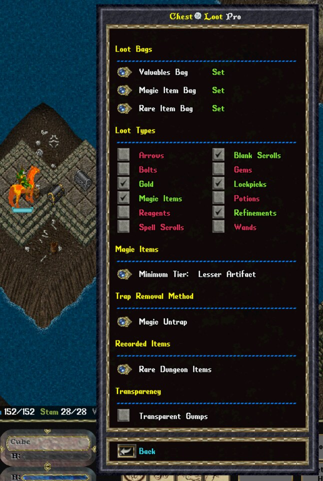

# ChestLoot Pro 1.0

**From lock to loot. Organized chest management for UOAlive, ClassicUO, and Razor Enhanced.**

[**Download ChestLoot Pro 1.0**](https://github.com/user-attachments/files/32315457/ChestLoot_Pro_v1.0.0_FINAL_VERIFIED.zip) · [View release](https://github.com/TBru81/ChestLoot-Pro/releases/tag/v1.0.0) · [Release notes](RELEASE_NOTES.md)

> Always use the download link above for the current production version. Copies shared elsewhere may be outdated.

ChestLoot Pro is a Razor Enhanced assistant for UOAlive's enhanced chest content. It helps with the repetitive steps of accessing treasure while leaving loot choices and Shop thefts under player control.

This release includes Dungeon Chest Mode, Shop Chest Mode, and Exodus Decorative Box Mode. Kotl Regal Case Mode is not included while field testing continues.

## Download and install

1. [Download ChestLoot Pro 1.0](https://github.com/user-attachments/files/32315457/ChestLoot_Pro_v1.0.0_FINAL_VERIFIED.zip), then extract the ZIP.
2. Copy `ChestLoot_Pro_1_0.py` and the entire `chestloot_modes` folder into Razor Enhanced's **Scripts** folder. Put them side by side; do not put the `.py` file inside `chestloot_modes`.
3. In Razor Enhanced's **Scripts** tab, add `ChestLoot_Pro_1_0.py` and run it. Stop any older ChestLoot script first.
4. Choose a mode, open Options, and select that mode's destination bags. Configurable loot types start enabled on a new installation.

ChestLoot Pro requires Ultima Online on UOAlive, ClassicUO with Razor Enhanced, and Python scripting enabled in Razor Enhanced.

## Character skills and supplies

ChestLoot Pro uses your character's actual skills and does not bypass UO skill checks. The skill needed to successfully handle a particular chest can vary with its difficulty.

| Mode | Skills used |
| --- | --- |
| **Dungeon Chest Mode** | **Lockpicking**, plus either **Magery** for Magic Untrap or **Remove Trap**, depending on the trap-removal method selected in Options. |
| **Shop Chest Mode** | **Lockpicking**, **Remove Trap**, and **Stealing**. Remove Trap is mandatory, and every theft remains player initiated. |
| **Exodus Decorative Box Mode** | **Detect Hidden** to search for hidden boxes, followed by **Lockpicking** and **Remove Trap**. |

Keep lockpicks in your backpack. When Magic Untrap is selected for Dungeon Chest Mode, your character must be able to cast the spell and have its required resources available.

**Exodus Detect Hidden:** GM Detect Hidden (100.0) is required to receive UO's Keen Eye message, which ChestLoot Pro uses to display a directional arrow toward the box. If you have not reached GM, the optional training mode can help you practice the skill before exploring Exodus Dungeon. Detect Hidden is not used when a box is already visible nearby.

## The three modes

- **Dungeon Chest Mode** assists with lockpicking, trap removal, opening, and selected looting. Configure Valuables, Magic Item, and Rare Item bags. The fresh-install minimum Magic Item tier is Lesser Magic. Recorded Rare Dungeon Items are collected when looting is enabled; unfamiliar Rare Deco items are called out for inspection.
- **Shop Chest Mode** prepares Shop containers with lockpicking and Remove Trap. Each theft is initiated by the player with the Steal Item button. Configure Shop Item and Rare Shop Item bags and review your recorded Rare Shop Items in Options.
- **Exodus Decorative Box Mode** finds nearby decorative boxes, handles access and selected looting, and uses Valuables and Keys bags. Optional Detect Hidden training stays under player control.

Options and recorded-rare lists use the shared ChestLoot title, including in transparent mode. The context labels `Rare Dungeon Items` and `Rare Shop Items` appear inside the appropriate gumps.

## Exodus: what one Scan Area click does

You do not need to keep pressing **Scan Area** while the search is running. If an Exodus box is already visible nearby, the script uses it without casting Detect Hidden.

- With **Detect Hidden Training off**, a completed Detect Hidden use gets one roughly three-second result window. If no box appears, the scan stops and asks you to reposition before clicking again. If the skill never opens a target cursor, the scan can retry on its own about every 10.5 seconds, up to a three-minute scan timeout. Watch the journal rather than repeatedly pressing the button.
- With **Detect Hidden Training on**, the script repeats Detect Hidden roughly every 10.25 seconds until it reveals a box, you press **Stop Training**, or you leave the scan's facet. Training starts disabled each session.

Once a box is found, **Remove Trap** makes at most five tries in that workflow, including any try blocked by a skill cooldown. A detected “You must wait” journal response leads to an approximately 10.5-second pause before the next try. If this script just used Detect Hidden, it waits for that known skill cooldown *before* its first Remove Trap try. A cooldown that prevents the target cursor from opening may instead consume a try with only a short pause; check the journal and let the current workflow finish before starting another scan.

## Saved choices

The script creates `ChestLootPro_Settings.json` and `ChestLootPro_Knowledge.json` beside the launcher. These hold bags, options, recorded rares, and learned items. Back up both files before updating, and keep them beside the new launcher to retain your records. For a truly fresh installation, start without those two files; no JSON files are included in the download.

If older `ChestMasterPro_Settings.json` or `ChestMasterPro_Knowledge.json` files are present and their ChestLoot counterparts are absent, the script copies their records into the new names. The older files remain untouched.

## Troubleshooting and player control

If a mode file is missing, confirm that the complete `chestloot_modes` folder is beside `ChestLoot_Pro_1_0.py`. If a bag is missing, select an existing, accessible bag again in that mode's Options. If an action stops, check journal feedback, range, tools, skills, mana, and carrying capacity.

ChestLoot Pro assists gameplay; it does not replace staying present. Follow UOAlive's current rules while using it. This project is an independent player-created tool, not an official UOAlive release.

## PetMedic Pro compatibility

ChestLoot Pro was extensively tested alongside [PetMedic Pro](https://github.com/TBru81/PetMedic-Pro), and no conflicts were observed during testing. Both tools can run together, allowing PetMedic Pro to continue caring for your pet while you use ChestLoot Pro. PetMedic Pro is optional and is not required to use any ChestLoot Pro mode.

## Files

- [Production release](https://github.com/user-attachments/files/32315457/ChestLoot_Pro_v1.0.0_FINAL_VERIFIED.zip)
- [ChestLoot Pro 1.0 release](https://github.com/TBru81/ChestLoot-Pro/releases/tag/v1.0.0)
- [ChestLoot Pro 1.0 release notes](RELEASE_NOTES.md)
